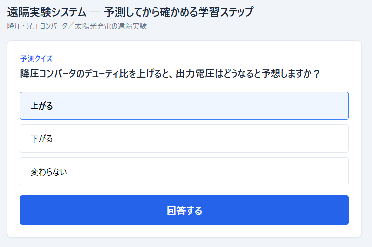
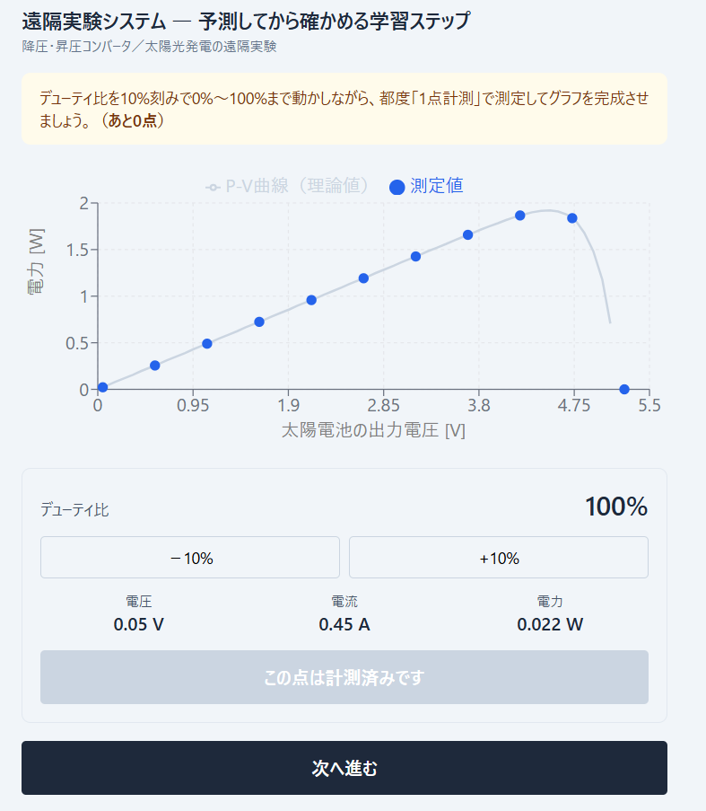
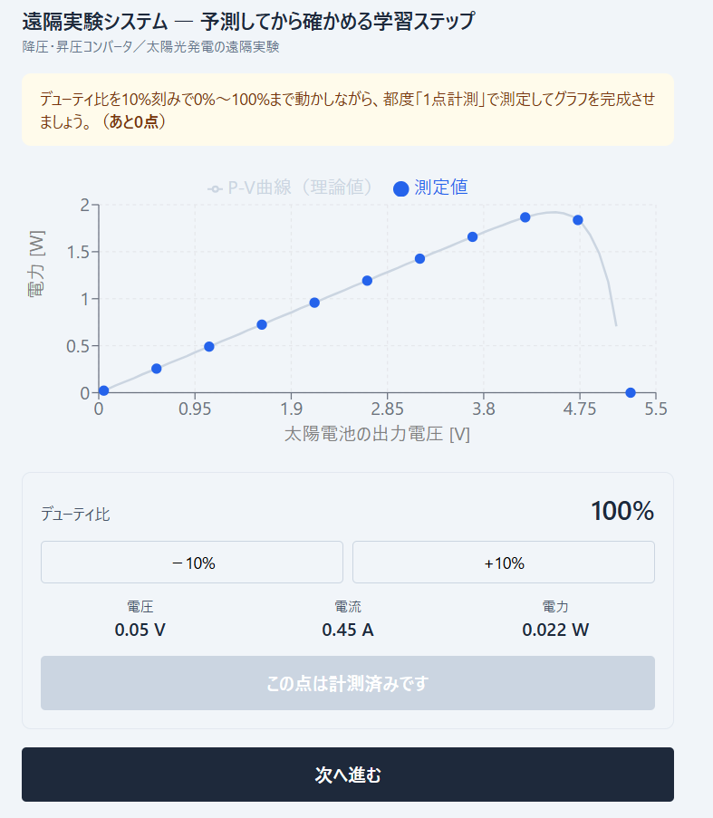

# remote-lab-checkpoint-ui

大学の遠隔実験教材に、「予測してから確かめる」学習ステップを追加する機能を設計・実装しました。
本リポジトリは、その画面部分をブラウザ上だけで動く形に作り直した再現版です。

デモ: https://remote-lab-checkpoint-ui.vercel.app/

| 予測クイズ | 実験 | 成績カルテ |
|---|---|---|
|  |  |  |

> このリポジトリの位置づけ
>
> 実際のシステムは研究室のサーバー上で稼働しており、実験装置・データベース・学習者の記録を含むため公開していません。
> 本リポジトリは、機能の設計意図と画面を示すために、フロントエンドのみを新たに実装したものです。
> 実際のシステムとの違いは、末尾の「再現版との差異」に整理しています。

---

## 背景

対象は、学習者がブラウザから太陽光発電の実験装置を操作し、測定値をリアルタイムに受け取る遠隔実験教材です。
このシステムは研究室で先行して開発され、授業内で45名の学生に利用された実績があります。
なお、この45名という数字は、私が引き継ぐ前のシステムに対するものです。

引き継ぐにあたって既存システムを実際に一通り使ってみたところ、
学習者が手順をなぞるだけで終わってしまうという課題を感じました。

手順書どおりにボタンを押していけば実験は完了します。しかし操作の前に自分で結果を予想する場面がないため、
何も考えずに進めても最後までたどり着けてしまいます。
また、操作ログを集めても「速いか遅いか」しか分からず、理解できているかどうかを判別できません。
指導教員からも、敷かれたレールの上をなぞるだけになっているという指摘がありました。

---

## 設計方針：予測 → 実験 → 確認

操作の前に結果を予測させれば、実験は確かめる行為に変わります。
そして予測と実測にずれがあれば、学習者はその原因を考えることになり、そこで理解が深まります。
実験そのものへの興味や関心も高まると考えました。

そこで、実験の流れを次のように組み替えました。

| 順序 | 内容 |
|---|---|
| 1 | 予測クイズ：デューティ比を上げると出力電圧はどうなるか、操作の前に予想する |
| 2 | 実験：デューティ比を0%から10%刻みで100%まで動かし、11点を測定する |
| 3a | 予測が当たった場合 → 応用問題（発電量が必ず増えるとは限らない理由を問う） |
| 3b | 予測が外れた場合 → 確認問題（出力電圧の変化のしかたを改めて問う） |
| 4 | 成績カルテ：学習結果の振り返りとフィードバックを表示する |

11点を測り終えるまで次に進めないため、グラフには必ず曲線の形が現れます。

---

## 設計上の判断と、その理由

### 1. 実験を挟むのは、予測クイズの直後の1回だけにした

当初は問題を出すたびに実験を挟む構成でしたが、予測を実測で検証するという行為は1回で完結します。
2問目以降にも同じ実験を繰り返させるのは、学習上の意味がないまま操作の手間だけを増やすことになるため、
1回に整理しました。

### 2. 不正解の扱いを、どこまで明示するか

最も判断に迷った点です。相反する2つの要求がありました。

- 正確に伝える — 誤解を残したまま先に進ませない
- 学習を止めない — 否定的なフィードバックで意欲を削がない

通常なら「間違えても再挑戦できる」という前提でどちらかに寄せられます。しかし
この教材は授業内で1回だけ使われて終わるため、離脱した学習者を取り戻す機会がありません。

そこで、正誤の判定は正確に保ちつつ、伝え方だけを変える方針を採りました。
不正解時は「もう一歩！考え方を確認しましょう」と表示し、正解の選択肢は明示したうえで、
なぜその考え方が正しくないのかを解説します。判定を曖昧にするのではなく、表現を変えています。

### 3. 回答後に自動で進めず、学習者がボタンを押す形にした

解説を読み終える速度は人によって違います。タイマーによる自動遷移は読み飛ばしを生むため、
遷移のタイミングを学習者に委ねました。

---

## LLMを教育に使うときに設けた制約

解説文と振り返りコメントの生成には、AWS Bedrock 上の LLM を使用しています。
ここで最も慎重に設計したのは、モデルの出力をそのまま学習者に見せないことです。

### 断定させない

成績カルテでは、プレテストとポストテストの結果をもとにコメントを生成します。
初期の実装では、所要時間が短くなったことを理解が深まった証拠だと断定する文章が生成されました。

しかし所要時間の短縮には、内容の理解が深まった場合と、単にシステムの操作に慣れた場合の両方があります。
前者だと断定して学習者に伝えることは、誤った自己認識を与えることになります。

そこでプロンプトに、どちらか一方に断定せず、両方の可能性がある書き方にするという制約を明示しました。
教育システムでは、モデルが自信を持って述べた内容がそのまま学習者の自己評価を形づくるため、
もっともらしいが根拠のない断定を許さない設計が必要だと考えています。

### 事実を落とさせない

同じく初期のプロンプトでは、「プレテストから7点のポストテストへと向上」という、
プレテストの点数が欠落した文章が生成されました。
そのため、両方の点数と所要時間を具体的な数値で必ず含めることを条件として明示しています。

### 表示領域に合わせて制約する

解説文は実験画面のモーダル内という狭い領域に表示されます。
初期実装では見出しや箇条書きを含む長文が返り、画面上で読めるものになっていませんでした。
出力側で切り詰めるのではなく、プロンプト側で長さと形式を指定する方針に変更し、
あわせて装飾記号を除去する処理を実装しています。

---

## 現時点での課題

この機能は、まだ実際の学習者に一度も使われていません。

実装は稼働中のシステムを複製した検証環境上で行っており、本番環境には反映していません。
そのため、ここに書いた設計判断はいずれも仮説の段階にとどまっており、効果は検証されていません。

背景として挙げた45名という利用実績は、私が引き継ぐ前のシステムに対するものです。
予測クイズと個別フィードバックについては、利用者はゼロです。

授業での利用機会に合わせて実際に使ってもらい、学習ログとアンケートを用いて評価することが、
今後の最優先の課題です。

---

## 技術構成

### 実際のシステム

| 領域 | 使用技術 |
|---|---|
| サーバー | Node.js / Express |
| データベース | MySQL |
| 配信 | Nginx |
| 実験装置の制御 | Raspberry Pi |
| 文章生成 | AWS Bedrock |

### 本リポジトリ（再現版）

TypeScript / React / Vite / Tailwind CSS / Recharts

---

## 再現版との差異

| | 実際のシステム | 本リポジトリ |
|---|---|---|
| 測定値 | 実験装置からリアルタイムに取得 | 太陽電池のモデルによる計算値 |
| データ保存 | MySQL に学習ログを記録 | 保存しない |
| 文章生成 | AWS Bedrock を呼び出し | 呼び出し処理は実装しているが、公開デモでは定型文にフォールバック |
| プレ／ポストテスト | 学習の前後に実施し、結果を集計 | 実施しない（成績カルテはサンプル値を表示） |

実測値には装置や環境に起因するばらつきがあるため、実際のグラフは理論曲線どおりにはなりません。
再現版のグラフは計算値に基づくものであり、実機の挙動を正確に再現したものではありません。

---

## 動かし方

```bash
npm install
npm run dev
```